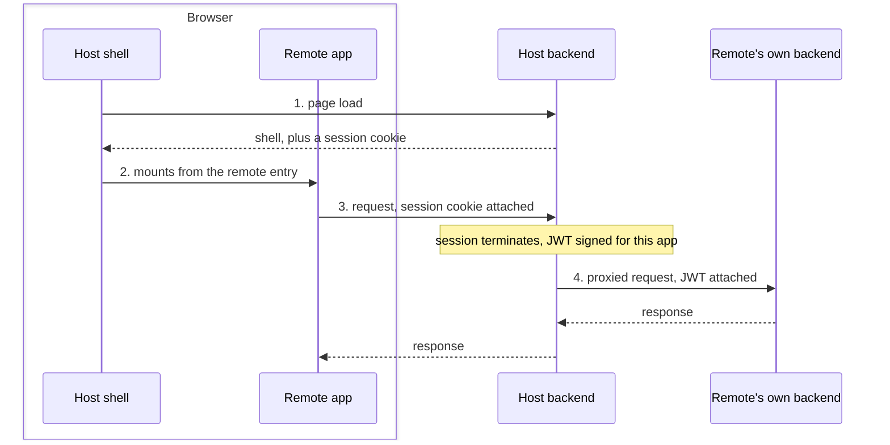

# 0001 Local Development Environment for Remote Applications

**Author(s):**

- Goh Jun Hong / [@junnhooong](https://github.com/junnhooong)
- Peh Yi Ming / [@yimingiscold](https://github.com/yimingiscold)

**Decision-makers:**

- Goh Jun Hong / [@junnhooong](https://github.com/junnhooong)
- Peh Yi Ming / [@yimingiscold](https://github.com/yimingiscold)
- Eileen Kang / [@kmye](https://github.com/kmye)
- Kelly Lim / [@kellylimmm](https://github.com/kellylimmm)
- Soong Yi Ning / [@yiningsoong](https://github.com/yiningsoong)
- Eugene Ang / [@evtpano](https://github.com/evtpano)
- Gerald Neo / [@nwsgerald](https://github.com/nwsgerald)
- Teh Chee Yang / [@cheellipadi](https://github.com/cheellipadi)
- Adam Ameera / [@ameeracadam](https://github.com/ameeracadam)

**Status:** Accepted

## Context

Teacher Workspace is a Module Federation host shell. The applications teachers use are **remote applications (MFEs)**, each in its own repository, owned by its own team. Nothing in this repository is checked out on a remote app developer's machine.

Running their own dev server alone renders the MFE in isolation: no shell around it, no session, no reachable backend. What they are shipping only makes sense in the full flow, and only the last of its four hops is theirs:

1. The browser loads the **host shell**, Teacher Workspace, which supplies the navigation, layout, and routing that mounts the remote. The host also establishes the session: its backend issues a session cookie, which the browser sends back on every subsequent request.
2. The shell mounts the **remote app** from its remote entry, the bundle a remote publishes for the host to load at runtime. The remote renders inside the shell and shares its origin, so its requests carry that cookie and it needs no auth of its own.
3. Those requests go to the **host backend**, where the session terminates: it authenticates the session, strips the cookie, and signs a short-lived JWT scoped to that one app.
4. The **remote's own backend** receives the proxied request, carrying that JWT and no cookie, and answers it.

That leaves the question of where the first three hops come from. The approaches tabled:

1. **Container image of the host.** One image, published by Teacher Workspace, holding the host shell, the host backend, and their datastores. It serves the shell and runs a local OIDC provider in place of the real one, so a remote app developer can sign in. Their requests then go through the same cookie-to-JWT exchange before reaching their own backend, reproducing all four hops locally. The remote app developer supplies two environment variables: where their remote entry is served, and where their backend listens. The costs are the size of the image and the versioning needed to keep it from falling behind the host running in production.
2. **Shared hosted proxy.** Teacher Workspace hosts one proxy that a remote app developer points their local app at, in place of the host backend: it authenticates them with an issued API key, mints the JWT, and forwards to their backend. Nothing to install, and centrally maintained, so no local copy can drift. But it cannot complete the flow, since a proxy on the internet has no route to a backend on a laptop, and it serves no shell, so hops 1 and 2 stay unsolved. It would also expose otherwise private infrastructure to the internet, on top of the key issuance and rotation, CORS for local origins, and shared state it takes to operate.
3. **Local proxy.** The same idea as the hosted proxy, but run on the remote app developer's own machine: they start it with one command, and it mints the JWT and forwards to their backend, which it can reach because both run there. Their code and build config stay untouched, at the cost of another process to run. But it only imitates the host backend: the exchange is not the real one, and there is still no shell.
4. **SDK in the remote's build.** A package the remote app team installs that hooks into their dev server proxy, rewriting requests and injecting the JWT. Nothing extra to run, but it imitates the host backend the same way, and the logic has to live in their build config, so the host's behaviour couples into every remote app repository.

## Decision

**Adopt the container image (option 1).** This was the group's preference by vote as the starting option.

It is the only approach that runs the host instead of imitating it: the shell and backend it bundles are the deployed ones, so all four hops run on the remote app developer's machine and behave as they will in production, as long as the image stays current. The only substitution is the identity provider, run locally so they can sign in. Option 2 cannot reach a backend on a laptop at all, and options 3 and 4 supply neither the shell nor the real exchange. Keeping everything local also avoids the costs of a hosted component: an internet-facing entry point in front of private infrastructure, keys to issue and rotate, CORS. Remote app repositories owe nothing but a remote entry and a backend for the container to point at.

The local proxy and the SDK remain fallbacks if the image proves too heavy in practice, at the cost of the shell and of an exchange that is not the real one.

## Consequences

Positive:

- Remote app developers can exercise the full flow locally: they sign in through the local identity provider, and their own backend receives requests that went through the real exchange, with nothing issued to them and no access to private infrastructure.
- Remote app repositories change nothing: no package to install, no build config to touch.

Negative:

- Image size, since one artifact holding the shell, the backend, and their datastores makes for a large pull.
- Maintaining the image falls to us, and teams outside this repository depend on it, so breaking it breaks them.

Follow-ups:

- A versioning and update mechanism, so local images do not fall behind what is deployed.
- Settling and documenting the two environment variables, the whole interface remote app teams see.
