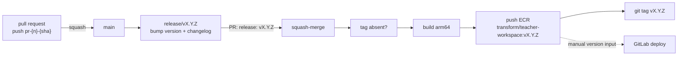

# 0002 Release Strategy

**Author(s):**

- Gerald Neo / [@nwsgerald](https://github.com/nwsgerald)

**Status:** Accepted

**Discussion:** [teacher-workspace #112](https://github.com/transformteamsg/teacher-workspace/issues/112),
settled in a meeting; no separate RFC issue was raised.

## Context

Teacher Workspace builds a working image but cannot distribute it by version.
CI runs on pull requests only, and #120 publishes each build to ECR as
`pr-<n>-<sha>` for pre-merge testing; the repository has no git tags and no
changelog, and `package.json` is at `0.0.0`. Partner developers
want to pull a known version of the host shell instead of building it, and the
GitLab pipeline that deploys the application takes an image tag as a manual
input. A versioned image in ECR is therefore the hand-off between this
repository and deployment, and #112 was scoped to exactly that: Teacher
Workspace only, `linux/arm64` only.

Onward already runs such a flow on top of the same `pr-` tagged builds. A
release is a pull request: a `release/vX.Y.Z` branch that bumps `package.json`
and adds a `CHANGELOG.md` section, titled `release: vX.Y.Z`. Merging it
triggers a workflow that tags the commit and pushes an image to ECR under the
same tag. It has cut 38
releases with no release tooling. Its history also shows what not to copy:
the version rule (a `feat` bumps minor, otherwise patch) is undocumented; two
releases whose title lacked the `v` merged and silently produced no tag or
image; the git tag is pushed before the image is built; and the changelog is a
bare commit list.

Three approaches were tabled:

1. **Onward's release-PR model.** A reviewed pull request is the release;
   merging it publishes. Proven, no tooling, and version, notes, tag and image
   all derive from one commit. Its known defects are cheap to fix in a port.
2. **A release-candidate branch.** Gives a stabilisation window and a place
   for hotfixes, at the cost of a long-lived branch and a merge-back step. Its
   value is mainly for libraries whose consumers test pre-releases; for an
   application validated on the pull request, feature branches and flags
   cover the same need, and neither approach solves database migrations or
   breaking API changes.
3. **Automated releases from commit history** (release-please, or releasing
   on every merge). Removes the manual step, but the team wants to group
   merges and write a summary, and the deploy is a manual, version-input
   trigger. It yields the same artefacts as option 1, so it remains a later
   refinement.

## Decision

**Adopt Onward's release-PR model (option 1), corrected where its history
showed defects.**

- **Trunk-based, no RC branch.** `main` is always releasable; unfinished work
  stays on a feature branch or behind a flag, and migrations or breaking API
  changes are planned explicitly. A hotfix is a PR to `main` and a patch
  release.
- **A release is a pull request.** Branch `release/vX.Y.Z`, changing only the
  root `package.json` version and `CHANGELOG.md`, titled `release: vX.Y.Z`.
  Squash-merge makes it one reviewed, revertible commit.
- **SemVer, decided from the squash titles since the last tag.** A `feat`
  bumps minor; only `fix`/`chore`/`docs`/`refactor`/`test` bumps patch; major
  is reserved for breaking the contract partner teams depend on: the
  host-shell and proxy interface, or the image's runtime contract. Versions
  start at `0.0.x`; `1.0.0` is the first version partner teams are told to
  pull.
- **`CHANGELOG.md` per release:** `## X.Y.Z (YYYY-MM-DD)`, a short prose
  summary, then entries grouped by type with PR and commit links. The list is
  derived from the git log between tags; the release PR body carries the same
  text.
- **Merging the release PR publishes.** A workflow runs only when a PR into
  `main` is merged with a title matching `release: vX.Y.Z`, against the merged
  commit. It does not re-run tests, since the release PR already passed CI. It
  checks the tag is absent, builds the `linux/arm64` image with the version in
  its OCI labels, pushes it via OIDC to ECR as
  `transform/teacher-workspace:vX.Y.Z`, then creates the annotated git tag.
  A version cannot be republished: the workflow exits if the git tag exists,
  and ECR refuses to overwrite a `v*` image tag. Three corrections to Onward's
  workflow:
  - the image is pushed **before** tagging, so a failed build leaves nothing
    behind;
  - a PR check on `release/**` branches rejects a malformed title, so a
    release cannot merge and silently skip the workflow;
  - the duplicate-tag check works.
- **PR CI publishes pre-merge builds, not versions.** Each pull request pushes
  `pr-<n>-<sha>` and `pr-<n>-latest` to the same ECR repository (#120), so any
  build can be deployed to a dev or test environment before merge. Only the
  release workflow publishes a `vX.Y.Z` tag.
- **The decision ends at ECR.** The GitLab pipeline takes `vX.Y.Z` as its
  version input and deploys the same image to staging and production;
  promotion stays manual.



### Worked examples

**A minor release.** Three pull requests have squash-merged into `main` since
`v0.3.1`:

```
$ git log --oneline v0.3.1..main
c7d8e9f feat(`server/proxy`): forward X-Request-Id to app backends (#131)
e4f5a6b fix(`host/sidebar`): keep the active app highlighted after reload (#128)
a1b2c3d chore(`deps`): bump hono to 4.9.2 (#126)
```

One of them is a `feat`, so the next version is `0.4.0`. The release author
opens:

```
Branch:  release/v0.4.0
Title:   release: v0.4.0
Files:   package.json   "version": "0.3.1" → "0.4.0"
         CHANGELOG.md   + the section below
```

```markdown
## 0.4.0 (2026-09-17)

Proxied requests now carry the caller's request ID through to app backends,
and the sidebar keeps the active app highlighted across reloads.

### Features ✨

- feat(`server/proxy`): forward X-Request-Id to app backends ([#131](…)) ([c7d8e9f](…))

### Bug Fixes 🐛

- fix(`host/sidebar`): keep the active app highlighted after reload ([#128](…)) ([e4f5a6b](…))

### Chores 🧹

- chore(`deps`): bump hono to 4.9.2 ([#126](…)) ([a1b2c3d](…))
```

The PR body's Summary states the version and that merging publishes it; its
Changes section carries the same grouped list; Test Plan is deleted, as the
template allows for non-code changes. CI runs on the PR as on any other,
publishing `pr-133-<sha>`, and the title check passes. On merge, `main` gains `release: v0.4.0 (#133)`; the
workflow confirms `v0.4.0` is untagged, builds and pushes
`transform/teacher-workspace:v0.4.0`, then tags `v0.4.0`.

**A hotfix.** Two days later a single fix lands:

```
$ git log --oneline v0.4.0..main
f0e1d2c fix(`server/session`): reject expired sessions before proxying (#135)
```

No `feat`, so the next version is `0.4.1`. The release author opens
`release/v0.4.1`, titled `release: v0.4.1`, with a one-line summary and a
single Bug Fixes entry; merge, tag and image follow as above. Had the PR
been titled `release: 0.4.1`, the title check would have failed and it could
not have merged: the mistake that produced two tagless releases in Onward.

## Consequences

Positive:

- Partner developers pull a known version, and the container reports it.
- Every release is a reviewed, revertible commit that the version, notes, tag
  and image all point at.
- Same flow as Onward, no new tooling, and the versioning rule is now written
  down.

Negative / follow-ups:

- "No tests at release" assumes PR CI is enforced, but `main` currently has no
  required status checks and requires zero approvals. Make the CI jobs and the
  release-title check required, and require one approval.
- A CI ticket must add the release workflow and the title check, reusing the
  OIDC role and ECR repository #120 already pushes to; then validate end to
  end with a dummy `v0.0.1`.
- `CONTRIBUTING.md` gains the release procedure, the versioning rule and the
  `release` type; `CHANGELOG.md` is created.
- The ECR repository must let `pr-<n>-latest` move while refusing to
  overwrite a `v*` tag: configure tag immutability with a `pr-*` exclusion, or
  enforce it in the workflow, before the first release.
- Only `linux/arm64` is published; `amd64` needs a native or emulated builder
  because the server is cgo.

## References

- [teacher-workspace #112](https://github.com/transformteamsg/teacher-workspace/issues/112)
- [teacher-workspace #120](https://github.com/transformteamsg/teacher-workspace/pull/120): pull request images to ECR
- [onward `release.yaml`](https://github.com/transformteamsg/onward/blob/main/.github/workflows/release.yaml)
- [onward `CHANGELOG.md`](https://github.com/transformteamsg/onward/blob/main/CHANGELOG.md)
- [Conventional Commits 1.0.0](https://www.conventionalcommits.org/en/v1.0.0/)
- [Semantic Versioning 2.0.0](https://semver.org/spec/v2.0.0.html)
